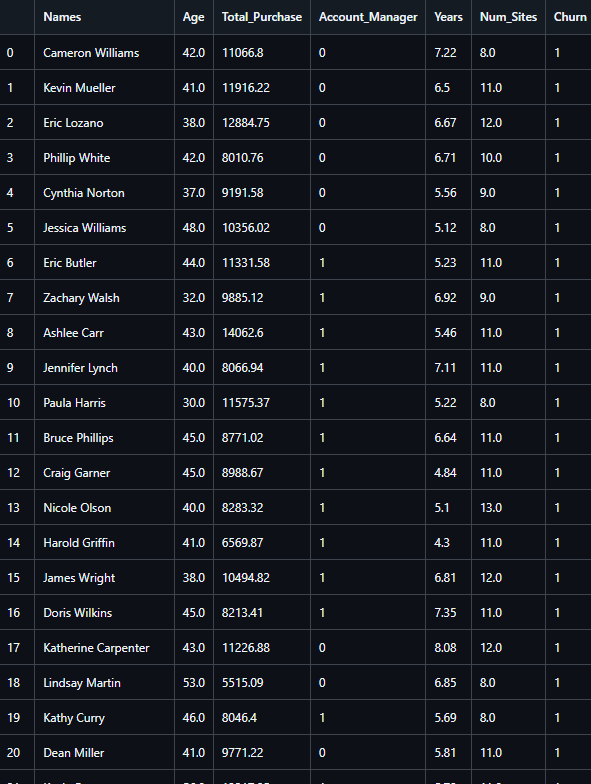
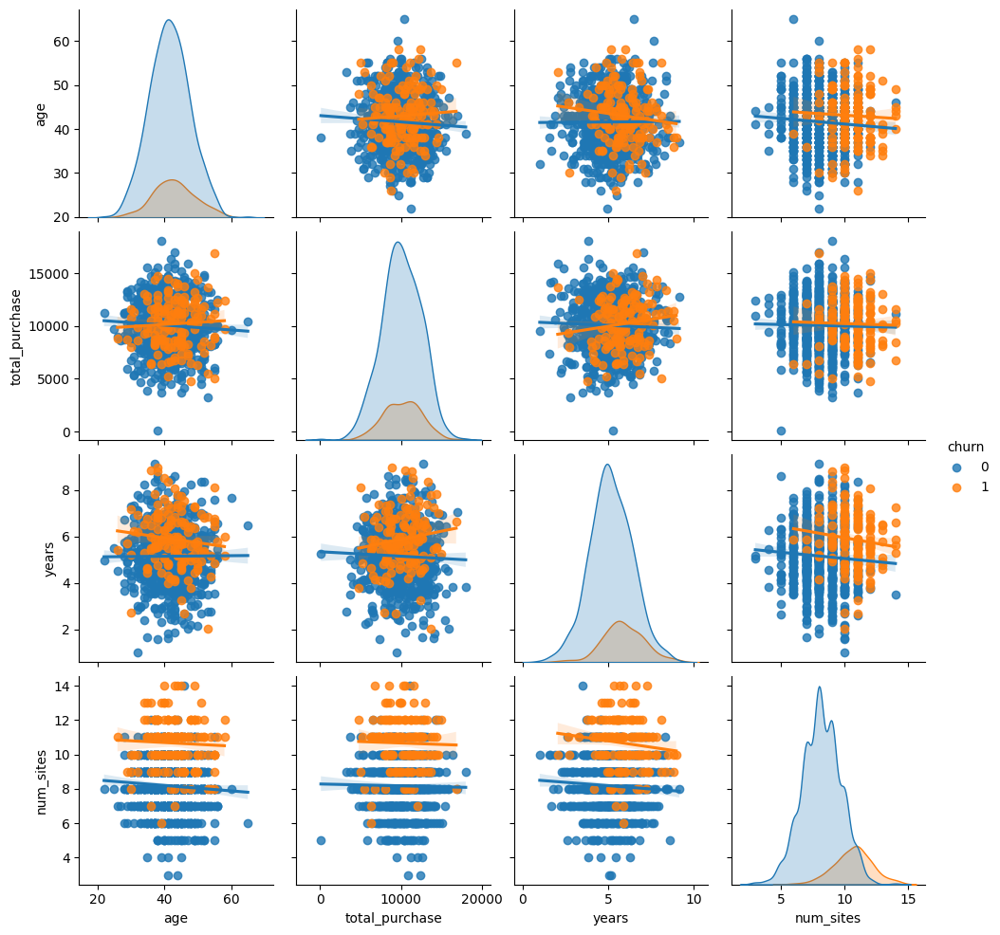
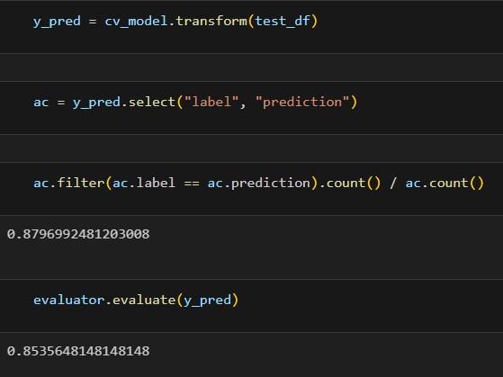

# Customer Churn Prediction with PySpark

This project is a **customer churn prediction system** built using **Apache Spark**. The goal is to analyze customer behavior and predict the likelihood of churn using gradient boosting models (GBM) on tabular customer data.

## Project Overview

Using **PySpark**, this project processes a dataset with customer attributes such as age, spending, and account tenure. The model classifies whether a customer will churn (leave) or stay.

## Key Features

* **PySpark-based scalable processing**
* **Exploratory Data Analysis (EDA)** on customer data
* **Feature engineering** (e.g., polynomial features)
* **Gradient Boosted Tree Classifier** via `GBTClassifier`
* **Hyperparameter tuning** with `CrossValidator` and `ParamGridBuilder`
* **Churn prediction** for new (unseen) customer data

## Dataset



Each row in the dataset represents a customer and includes:

| Column            | Description                            |
| ----------------- | -------------------------------------- |
| `names`           | Customer name                          |
| `age`             | Age of the customer                    |
| `total_purchase`  | Total money spent                      |
| `account_manager` | Whether an account manager is assigned |
| `years`           | Number of years as a customer          |
| `num_sites`       | Number of sites they use               |
| `churn`           | 1 if churned, 0 otherwise              |

## Exploratory Data Analysis (EDA)

* Descriptive statistics for numeric columns
* Class balance inspection
* Distribution of variables by churn
* Visualization with `seaborn.pairplot`



## Feature Engineering

* Removed missing values
* Added polynomial features (`age_square`)
* Used `VectorAssembler` for machine learning input

## Modeling

* **Train-test split:** 70/30
* **Classifier:** Gradient Boosted Tree (GBT)
* **Tuning:** 10-fold cross-validation over:

  * `maxDepth`: \[2, 4, 6]
  * `maxBins`: \[20, 30]
  * `maxIter`: \[10, 20]

```python
GBTClassifier(maxIter=10, featuresCol="features", labelCol="label")
```

## Results

* Accuracy on test set:  


## Inference on New Customers

Sample predictions for new customers with unseen data:

| Name             | Prediction | Probability                |
| ---------------- | ---------- | -------------------------- |
| Ali Ahmetoğlu    | 1.0        | \[0.20, 0.80] (will churn) |
| Harika Gündüz    | 0.0        | \[0.85, 0.15] (will stay)  |
| Ata Bakmayan Ali | 0.0        | \[0.99, 0.01] (will stay)  |

## Technologies Used

| Technology  | Purpose                                     |
| ----------- | ------------------------------------------- |
| **PySpark** | Distributed data processing and ML pipeline |
| **Seaborn** | Visualization                               |
| **Pandas**  | Data manipulation                           |
| **Python**  | Core programming language                   |

## Setup Instructions

1. Install Spark and set environment variables (e.g., `SPARK_HOME`)
2. Install dependencies:

```bash
pip install pyspark findspark pandas seaborn
```

3. Place `churn.csv` in your project directory.
4. Run the notebook or script.

## Sample Commands

```python
import findspark
findspark.init("C:\\spark")  # Your Spark installation path
```

## Developers

* **Alperen Arda** – [alperen.arda.adem22@gmail.com](mailto:alperen.arda.adem22@gmail.com)
